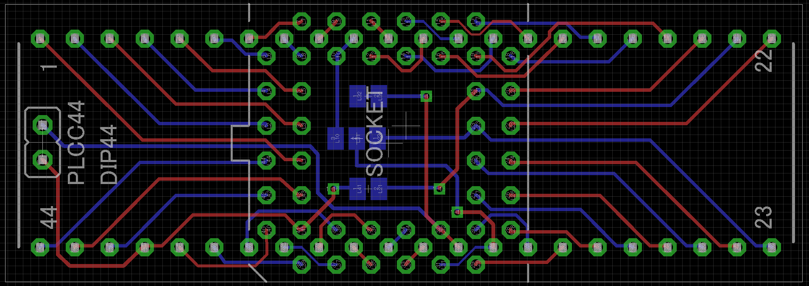

# PGA44 to DIP44 socket PCB project using EAGLE CAD

## What is this?

* This is very simple electric circuit diagram on EAGLE CAD.
* This is my first trial for learn how to use EAGLE CAD.
* PGA44 <--> DIP44 pin assignments are side by side.
* I made for prototyping CPLD device (Xilinx XC95 series) on the breadboards.

* This is sample routing result:

## How to use

* You have to solder PGA44-PLCC44 socket and DIP22 x 2 headers.
* If your usage is side by side mapped pin conversion, you have to no additional works.
* If your usage is Xilinx XC95 series, add jumper pin header to head of board and solder x2 path-capacitors (ex: 0.1uF) onto SMD jumpers bottom of center board.
  * SMD jumpers shorts circuit between 21-41(VCCINT), 23-10-31(GND).
  * If jumper pin header closed, it shorts circuit between VCCINT and VCCIO. It means commonly voltage usage.

TODO: Example solder photos.

## LICENSE

* [Under CC BY-NC-SA 2.1](https://creativecommons.org/licenses/by-nc-sa/2.1/jp/deed.en)
